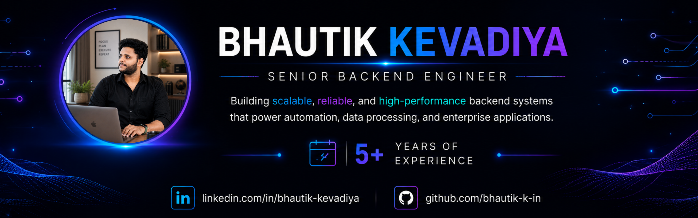

<!-- ========================================================= -->
<!--                       HERO BANNER                          -->
<!-- ========================================================= -->

  

 

<!-- ========================================================= -->
<!--                    ANIMATED TYPING                         -->
<!-- ========================================================= -->

---

<h1 align="center">

Hi 👋 I'm Bhautik Kevadiya

</h1>

<h3 align="center">

Senior Backend Engineer • Automation Engineer • AWS Cloud Engineer

</h3>

Building production-grade backend systems, workflow automation platforms,
distributed cloud applications, and AI-powered automation solutions.

 

---

# 🤝 Let's Connect

&nbsp;&nbsp;&nbsp;

&nbsp;&nbsp;&nbsp;

&nbsp;&nbsp;&nbsp;

&nbsp;&nbsp;&nbsp;

&nbsp;&nbsp;&nbsp;

&nbsp;&nbsp;&nbsp;

&nbsp;&nbsp;&nbsp;

---

# 💫 Who Am I?

| | |
|:---|:---|
| 👨‍💻 **Role** | Senior Backend Engineer |
| 🏢 **Experience** | 5+ Years |
| 📍 **Location** | India |
| ⚡ **Specialization** | Backend Engineering, Workflow Automation, Distributed Systems |
| ☁️ **Cloud** | AWS (ECS, EC2, SQS, CloudWatch, S3, SSM) |
| 💻 **Languages** | TypeScript, JavaScript |
| 🚀 **Backend** | Node.js, NestJS, Express.js, GraphQL |
| 🗄️ **Databases** | MySQL, MongoDB, DynamoDB |
| 🤖 **Automation** | Puppeteer, Browser Automation, AI Workflows |
| 🌱 **Currently Learning** | AI Agents, MCP, Kubernetes, Advanced System Design |
| 🎯 **Mission** | Build scalable systems that eliminate manual work. |

---

# 🚀 What I Do

✅ Design scalable backend architectures

✅ Build production automation platforms

✅ Develop enterprise REST & GraphQL APIs

✅ Automate complex business workflows

✅ Engineer distributed queue-based systems

✅ Optimize high-volume backend processing

✅ Build cloud-native AWS applications

✅ Integrate AI into production software

---

---

<!-- PART 2 STARTS BELOW -->
